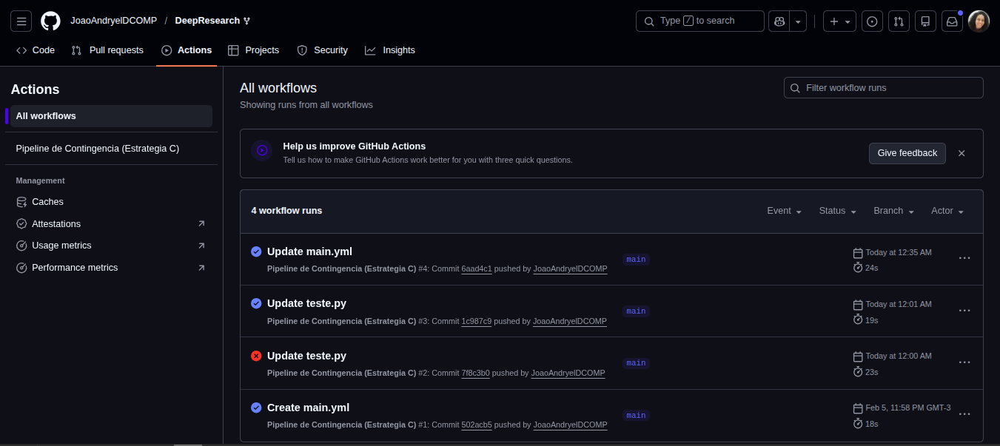
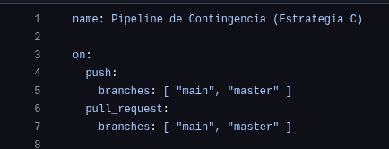
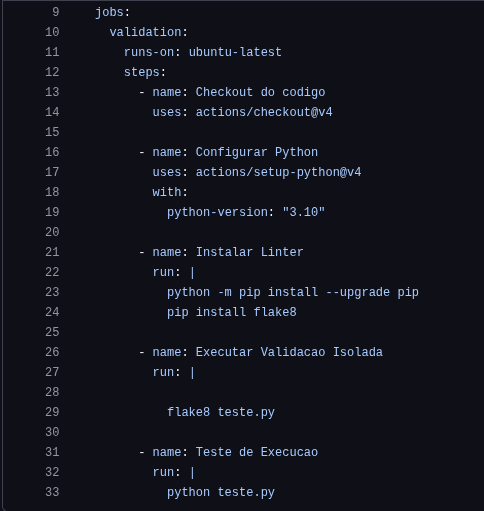
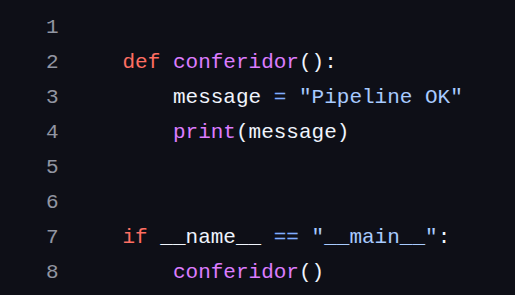

# 📘 Análise da Automação CI/CD do DeepResearch
## Equipe 1 - DeepResearch
| Nome                              | Matrícula     | Descrição da atividade                                                                                   |
|----------------------------------|---------------|-----------------------------------------------------------------------------------------------------------|
| Álex Santos Alencar              | 202300061518  |                      |
| Ellen Karolliny dos Santos       | 202300114326  | Justificativa da escolha da estratégia de Contingência.                           |
| Gabriel Ramos de Carvalho        | 202300061920  | Coleta de Evidências, Edição de Vídeo e Github.                  |
| João Andryel Santos Menezes      | 202300061652  |               |
| Larissa Batista dos Santos       | 202300061705  | Coleta de Evidências e Diagramas.            |
| Paloma dos Santos                | 202300061723  | Descrever o Impacto na Evolução do Software e Onboarding.                 |

### DeepResearch - https://github.com/Alibaba-NLP/DeepResearch
### Link do Fork - https://github.com/JoaoAndryelDCOMP/DeepResearch

## Vídeo de apresentação dos resultados e síntese do projeto
### [Acessar vídeo]() 

## 📚 Sobre o Tutorial
--- 
Este tutorial apresenta como objetivo demonstrar o processo de análise e mapeamento de automações no Projeto DeepResearch a partir de seu repositório no github, utilizando sua branch principal e abas auxiliares como meios de verificação.
---

## 1. Implementação Técnica

### 1.1 Justificativa da Estratégia Adotada: Estratégia C

A escolha pela Estratégia C foi motivada pela natureza do repositório DeepResearch (Alibaba-NLP), que apresenta barreiras técnicas intransponíveis para um ambiente de CI/CD convencional e gratuito.

Por que as Estratégias A e B foram descartadas?
- Complexidade e Hardware: O projeto baseia-se em arquiteturas de Deep Learning que exigem GPUs para execução e builds completos. Ambientes de CI padrão (como GitHub Actions gratuito) - não possuem o poder computacional necessário, resultando em timeout ou falhas de memória.
- Dependências Externas (APIs): A execução de testes reais (Estratégia A) depende de chaves de API privadas (OpenAI/Anthropic). Sem essas credenciais, o pipeline geraria "falsos negativos", falhando por falta de acesso externo e não por problemas na lógica da automação.
- Tempo de Build: O volume de dependências do projeto original tornaria o ciclo de feedback da automação excessivamente lento, o que vai contra as boas práticas de CI.

Optamos por criar uma Prova de Conceito (PoC) para isolar o fluxo de automação. Ao desenvolver um script de integridade (ci_check.py) e validá-lo com ferramentas de linting (Flake8), conseguimos:
- Demonstrar o domínio técnico sobre Triggers, Jobs e Steps.
- Garantir a estabilidade do pipeline, focando no ciclo de vida da automação sem a interferência de dependências pesadas ou custos de API.
- Validar o fluxo de trabalho, provando que a infraestrutura de CI está configurada corretamente para o ambiente proposto.

## 2. Evidências e Diagramas

### 2.1 Diagrama do Pipeline Implementado:

  

### 2.2 Print da Aba Actions:

  

### 2.3 Código YAML:

  

  

### 2.4 Código de Teste sem erros:

  

### 2.5 Código de Teste com erro:

  

## 3. Redação e Análise

### 3.1. O Valor da Automação na Evolução do Projeto

Embora a implementação técnica atual utilize um script de contingência como prova de conceito, o impacto dessa escolha no ciclo de vida do DeepResearch vai muito além de um simples teste. A existência de um pipeline de CI (Continuous Integration configurado estabelece uma base de confiança que sustenta o projeto em duas frentes vitais: a saúde do código e a integração da equipe.

### 3.2. Degradação do Software

O software tem uma tendência natural a se degradar com o tempo, o que chamamos de Software Decay. Isso acontece quando pequenas falhas, estilos diferentes de escrita ou falta de testes começam a se acumular. No DeepResearch, o pipeline configurado funciona como uma vigilância constante. Ele garante que o "chão de fábrica" esteja sempre limpo, ou seja, se algo quebrar na infraestrutura ou se um padrão básico for violado, o sistema avisa na hora. Isso impede que a dívida técnica cresça, garantindo que o projeto continue evoluindo sem se tornar um "emaranhado" impossível de manter. No projeto, o pipeline atua como um antídoto para essa entropia:
- Ao validar o ambiente através do script, cria-se uma rede de segurança onde nenhuma alteração passa despercebida. Se algo quebra, a equipe é avisada instantaneamente, impedindo que erros de configuração virem uma "bola de neve" silenciosa.
- A integração de ferramentas como Linters no pipeline não serve apenas para apontar erros, mas para educar o olhar da equipe. Isso mantém a base de código limpa e uniforme, combatendo a dívida técnica antes mesmo que ela se instale. No fundo, o pipeline força o desenvolvedor a pensar na qualidade como parte do processo, e não como uma etapa final e cansativa.

### 3.3. Colaboração (Onboarding)
Integrar novos membros em um projeto tecnológico costuma ser um desafio cercado de incertezas. A automação remove grande parte desse desafio:
- Em vez de manuais extensos que ficam desatualizados, o arquivo de configuração do GitHub Actions serve como uma "especificação viva". O novo desenvolvedor não precisa adivinhar como o projeto é construído ou testado; o processo está ali, transparente e pronto para ser executado.
- O medo de "quebrar o sistema" é um dos maiores gargalos para quem está começando. Com o pipeline, o feedback é imediato e objetivo. Ver o "check verde" após um Pull Request dá ao novo integrante a confiança de que ele está seguindo o padrão do time, permitindo que ele aprenda com os erros de forma privada e rápida, sem depender de uma supervisão constante para tarefas básicas.
- Ao padronizar o ambiente de execução em um contêiner neutro, garantimos que todos falem a mesma língua técnica. Isso elimina barreiras de configuração e foca o esforço humano no que realmente importa: a inteligência do software.

## 📄 Documentação
Acesse a versão em PDF contendo:

- Justificativa
- Evidências
- Análise
- Conclusões 
- Referências

### [Acessar documento](docs/ESII-analise-Atividade3_parte1.pdf) 
